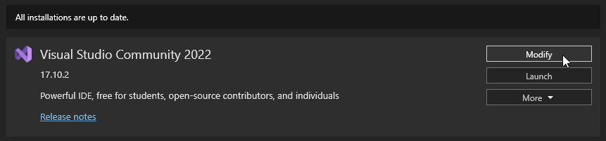
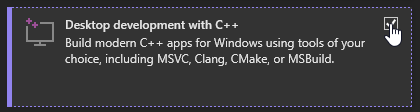
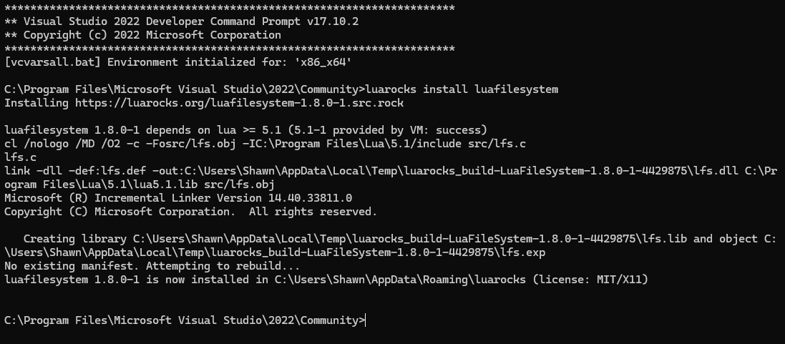

# Lua Installation on Windows

To install Lua on Windows, you'll need Visual Studio Community 2022, which provides essential build tools for LuaRocks modules like `LuaFileSystem`.

> [!WARNING]
> Note that "Desktop Development with C++" is a large download, approximately 9.36 GB in size.

```cmd
winget install --source=winget --id=Microsoft.VisualStudio.2022.Community
```

Wait for the installation to complete.

After installing Visual Studio Community 2022:

1. Launch the Visual Studio Installer from the Start Menu or navigate to `C:\Program Files (x86)\Microsoft Visual Studio\Installer\setup.exe`.

2. Select "Modify" for Visual Studio Community 2022 installation.



3. Choose to install "Desktop Development with C++." This process will take some time.



4. Restart your computer after the installation completes. You can do this quickly using the following command, but ensure to save your work before proceeding:

```cmd
shutdown /r /f /t 0
```

5. Once logged back in, locate and open the "**x86_x64 Cross Tools Command Prompt for VS 2022**" shortcut from the Start Menu.

    - This command prompt provides necessary build tools for installing libraries such as `LuaFileSystem`.

6. You can now proceed with installing LuaRocks modules. For example, use `luarocks install luafilesystem` to install `LuaFileSystem`, including any required building tools. Note that some LuaRocks libraries may depend on third-party modules and libraries which you might need to include in your system's PATH separately from LuaRocks.

